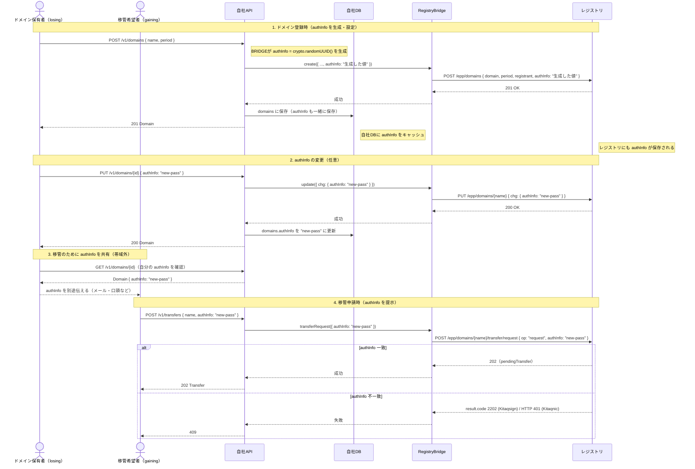

# authInfo ライフサイクル

authInfo（移管パスフレーズ）はドメインに紐づくパスワード的な値。
レジストリ側で管理され、移管申請時の本人確認に使われる。

---

## ライフサイクル全体図

---

## ポイント

| 項目 | 内容 |
|------|------|
| 保管場所 | **レジストリ + 自社DB**（自社DBにキャッシュして会員が確認・変更できるようにする） |
| 設定タイミング | ドメイン登録（create）時に必須 |
| 変更 | update の `chg.authInfo` でいつでも変更可能 |
| 使用タイミング | 移管申請（transfer request）時に gaining 側が提示 |
| 検証者 | レジストリ（自社APIは検証しない） |
| 共有方法 | 帯域外（losing → gaining へ別途連絡） |
| 不一致時 | Kitaqsign: `result.code 2202` / Kitaqnic: `HTTP 401` → どちらも会員APIに `409` で返す |
