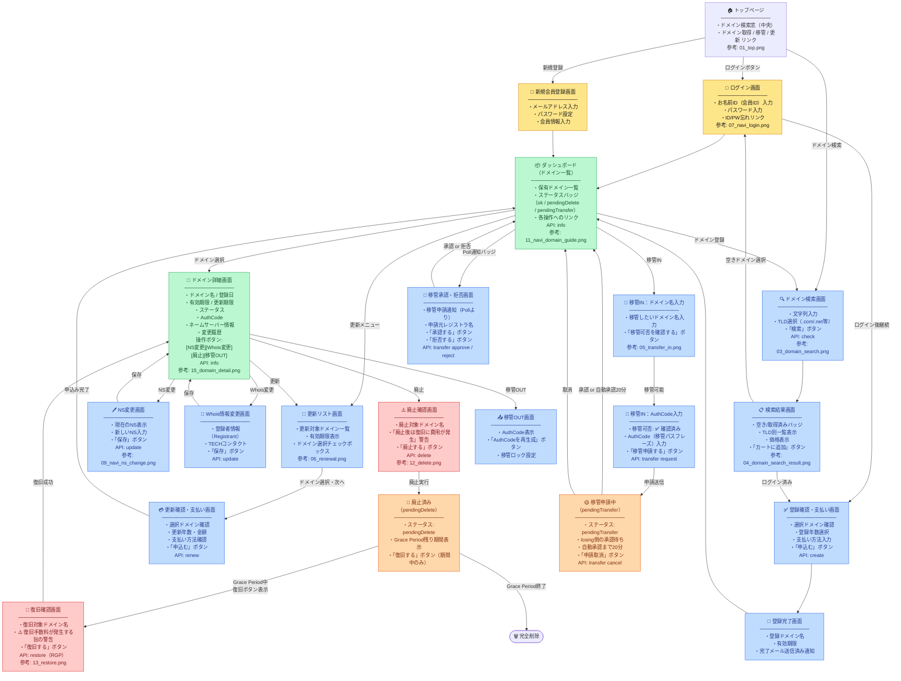

# 疑似レジストラアプリ 画面遷移図

作成日: 2026-08-24  
参考: お名前.comスクリーンショット調査（同ディレクトリ内）

---

---

## 画面一覧

| # | 画面名 | 対応API | 参考スクショ |
|---|--------|---------|------------|
| 1 | トップページ | — | 01_top.png |
| 2 | ログイン画面 | — | 07_navi_login.png |
| 3 | 新規会員登録画面 | — | — |
| 4 | ドメイン検索画面 | check | 03_domain_search.png |
| 5 | 検索結果画面 | check | 04_domain_search_result.png |
| 6 | 登録確認・支払い画面 | create | — |
| 7 | 登録完了画面 | — | — |
| 8 | ダッシュボード（ドメイン一覧） | info | 11_navi_domain_guide.png |
| 9 | ドメイン詳細画面 | info | 15_domain_detail.png |
| 10 | 更新リスト画面 | — | 06_renewal.png |
| 11 | 更新確認・支払い画面 | renew | — |
| 12 | NS変更画面 | update | 09_navi_ns_change.png |
| 13 | Whois情報変更画面 | update | — |
| 14 | 廃止確認画面 | delete | 12_delete.png |
| 15 | 廃止済み表示（pendingDelete） | — | — |
| 16 | 復旧確認画面 | restore | 13_restore.png |
| 17 | 移管IN：ドメイン名入力・可否確認 | — | 05_transfer_in.png |
| 18 | 移管IN：AuthCode入力 | transfer request | — |
| 19 | 移管申請中（pendingTransfer） | transfer cancel | — |
| 20 | 移管承認・拒否画面 | transfer approve/reject | — |
| 21 | 移管OUT画面 | rotate-auth-info | — |

---

## 色の意味

| 色 | 意味 |
|---|------|
| 🟡 黄 | 認証画面（ログイン・登録） |
| 🟢 緑 | ハブ画面（ダッシュボード・詳細）— 全操作の起点 |
| 🔵 青 | 通常操作画面（検索・更新・修正・移管） |
| 🔴 赤 | 危険操作画面（廃止・復旧 — 費用/不可逆） |
| 🟠 橙 | 保留中ステータス画面（pendingDelete・pendingTransfer） |

---

## お名前.comとの主な設計差分

| 項目 | お名前.com | 本アプリ |
|------|-----------|---------|
| 廃止方法 | 自動更新OFFで期限切れ廃止 | EPP準拠で廃止ボタンを直接実装 |
| 復旧 | 追加費用あり・数日かかる | Grace Period中即時復旧（費用警告は表示） |
| 移管完了時間 | 10日前後 | 20分で自動承認（ハッカソン短縮） |
| 移管IN手順 | 移管可否確認 → authCode入力 | 同じ順番で実装 |
| 更新画面 | ダッシュボードとは独立した更新リスト画面 | 同じ構成で実装 |
| ドメイン詳細 | AuthCode・変更履歴・公開代行設定等も表示 | 同じ構成で実装 |
